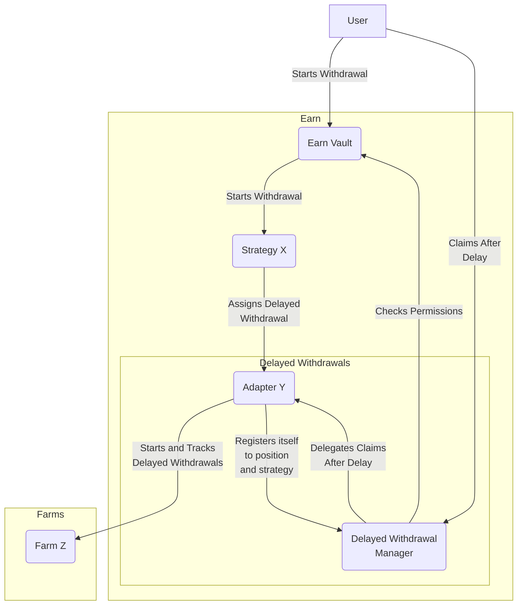

# Earn Periphery
This repository handles everything that is not related to the core logic of the Earn protocol, but is still needs to be deployed on every chain.

We recommend reading the [Earn Core README](https://github.com/balmy-protocol/earn-core) to understand the overall Earn ecosystem.

## Strategies
This repository contains the implementation for many different strategies. Now, strategies can behave pretty similar to each other, so we've decided to create "layers" that can be reused between strategies. 

### Layers
Layers add different capabilities to Earn strategies. Each layer has a "base" definition that determines the interface that all implementations must follow. Then, each layer version can choose how to implement that interface. For example, one version of the "creation validation" layer (explained below) could verify that the user signed the terms of service before depositing. Another version could simply allow all users to deposit without any additional verification.

It's important to mention that we wanted to design layers to be highly composable, which is hard to do in Solidity. So we've decided to make use of abstract functions to define what each layer needs to implement, but also what they need from their underlying layer. By doing so, all layers can be integrated with other ones without having to know the underlying implementation details. We recommend looking into different layer implementations to get a better understanding of this.

#### Connector
The connector layer is responsible for connecting to "farms". Farms are other projects that generate yield for the strategy, like Aave, Yearn, etc. So, for example, if you wanted to create a strategy that used Aave to generate yield, you would use Aave's implementation for the connector layer. 

#### Creation validation
The creation validation layer is responsible for validating the creation of a new position for the strategy. For example, if the strategy required the user to sign terms of service before depositing, it would be validated here.

#### Guardian
Guardians are one of the most important differentiator for Earn strategies. Guardians are in charge of protecting the strategy's funds from malicious actors. They have the ability to withdraw funds from an underlying farm back into the strategy so, in the case of a hack, the guardian can step in and rescue the funds from being lost. They can also charge a fee for rescued funds.

#### Fees
The fees layer is responsible for handling the fees that the strategy will charge their users. These fees could be deposit fees, withdrawal fees, performance fees, etc.

#### Liquidity Mining
This layer is responsible for managing the liquidity mining rewards for the strategy. The idea is that external entities can provide extra rewards to incentivize users to deposit into the strategy.

### Delayed Withdrawals

Like we explained before, sometimes strategies can implement a lock up periods for withdrawals. In that case, when a user wants to execute a withdrawal, the strategy will call a "delayed withdrawal" adapter to handle the process. It goes without saying that each "delayed withdrawal" will be associated to a position so that only accounts with permissions can retrieve the funds later

#### Delayed Withdrawal Adapter
When a delayed withdrawal is started, the strategy will delegate the process to an delayed withdrawal adapter. Each adapter will know how to handle withdrawals with one or more farms. We chose this approach of separating this process from the strategy mainly for two reason:

1. To be able to re-use withdrawal adapters with various different strategies
2. So that we don't have to worry about migrating delayed withdrawals when a strategy is updated

#### Delayed Withdrawal Manager

When a delayed withdrawal is started, the Earn strategy will delegate the withdrawal to a delayed withdraw adapter. That adapter is the one that will start the withdraw, and then register itself to the manager. By doing so, we will be able to track all pending withdrawals for a specific position in one place.

After the delay has passed, the user will be able to claim their funds by calling the manager. The manager will then delegate the process to the adapter that originally started the withdrawal, but only after checking that the user has permission to do so.



### Deployments
Most strategies can be reused quite a lot. For example, a strategy that uses Aave as a farm can be used for all Aave tokens, on all chains where Aave is deployed. This means that we could deploy the same strategy quite a few times, but with slightly different configuration.

To reduce the cost of deploying strategies, we've decided to use [ClonesWithImmutableArgs](https://github.com/wighawag/clones-with-immutable-args), since most configuration we currently support is immutable in their nature.

## Earn Vault Companion
The Earn Vault Companion is a contract that is deployed alongside the Earn Vault. It is meant to add new capabilities to the Earn Vault, like:
- Multicall capabilities
- Permit2 deposits
- Swap and deposit
- Withdraw and swap

## Global Registry
The Global Registry is a contract that simply associates a key with a contract address. This is helpful when we want to upgrade a non-core contract without having to update the address on all the strategies that are using it.

## Usage

This is a list of the most frequently needed commands.

### Build

Build the contracts:

```sh
$ forge build
```

### Clean

Delete the build artifacts and cache directories:

```sh
$ forge clean
```

### Compile

Compile the contracts:

```sh
$ forge build
```

### Coverage

Get a test coverage report:

```sh
$ forge coverage
```

### Format

Format the contracts:

```sh
$ forge fmt
```

### Gas Usage

Get a gas report:

```sh
$ forge test --gas-report
```

### Lint

Lint the contracts:

```sh
$ pnpm lint
```

### Test

Run the tests:

```sh
$ forge test
```

## License

This project is licensed under MIT.

## Integration testing for stragety and earn vault

the most import test are 

- `test_createPosition_CheckRewardsWithLoss`
- `test_withdraw_CheckRewards`
- `test_specialWithdraw_CheckRewards`

#### ERC4626 Stragety

the [set up code and the function clone stragety](https://github.com/Balmy-protocol/earn-periphery/blob/8e76eb340759a81848f0909ab29d7b563f456267/test/unit/vault/EarnVault.t.sol#L215) is the set up code to deploy a stragety.

To deploy a ERC4626 Stragety, we have to deploy a [local ERC4626 vault](https://github.com/Balmy-protocol/earn-periphery/blob/8e76eb340759a81848f0909ab29d7b563f456267/test/unit/vault/EarnVault.t.sol#L89) as well.

#### Compound V2 Stragety

the [set up code and the function clone stragety](https://github.com/Balmy-protocol/earn-periphery/blob/8e76eb340759a81848f0909ab29d7b563f456267/test/unit/vault/CompoundstrategyEarnVault.t.sol#L256) is the set up code to deploy a stragety.

To test Compound Stragety, we have to use mainnet fork testing,

we need to pick [a asset and a cToken](https://github.com/Balmy-protocol/earn-periphery/blob/8e76eb340759a81848f0909ab29d7b563f456267/test/unit/vault/CompoundstrategyEarnVault.t.sol#L160)

#### LIDO Stragety

the [set up code and the function clone stragety](https://github.com/Balmy-protocol/earn-periphery/blob/8e76eb340759a81848f0909ab29d7b563f456267/test/unit/vault/LidoStrategyEarnVault.t.sol#L322) is the set up code to deploy a stragety.

We need to set up the delayed withdrawal manager and mock withdrawal queue for LIDO Stragety.

we have to use mainnet fork testing as well.

Example test command

```solidity
forge test -vv --match-path test/unit/vault/LidoStrategyEarnVault.t.sol --match-test "test_deposit_share_charged_performance_fee" --fork-url [rpc-url]
```

#### AAVE Stragety
made out of scope for this audit.